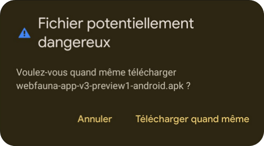
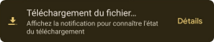
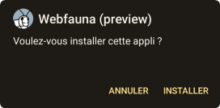
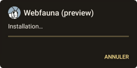
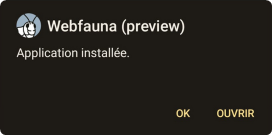

# Guide d’installation de Webfauna (preview) 

## Avant-propos 

### Information techniques 

L’installation de cette version de Webfauna (preview) nécessite un téléphone mobile Android. 

Attention : Ce guide d’installation a été réalisé avec une version d’Android 13. Les étapes d’installation de Webfauna (preview) peuvent légèrement varier d’une version d’Android à l’autre.

**En cas de problème ou de question durant l’installation, merci de contacter support@infofauna.ch.** 

### Qu’est-ce que signifie Webfauna (preview) ? 

Webfauna (preview) est une version de l’application mobile Webfauna. Cette version est fonctionnelle, mais peut encore comporter des défauts de conception. Cette version permet à notre équipe informatique de tester et de corriger en continu les éventuelles anomalies de l’application avant de pouvoir vous la proposer de manière officielle sur le Store Google Play. 

**Important : Toutes les données saisies et envoyées via Webfauna (preview) sont officielles et seront directement envoyées dans notre base de données. Vos données seront directement consultables sur https://webfauna.cscf.ch.** 

Note : L’application Webfauna (preview) est installée en parallèle de l’application Webfauna actuelle. Vous pouvez dès à présent utiliser uniquement Webfauna (preview) pour saisir et envoyer vos données. Néanmoins, si l’application Webfauna (preview) devait être inutilisable sur votre téléphone, vous avez toujours la possibilité de saisir et de transmettre vos données via Webfauna. 

## Installation 

1. Pour installer l’application sur votre téléphone mobile, scanner le QR-code ou suivre le lien. 

https://bit.ly/3VgbdQ1

2. Un message de mise en garde peut s'afficher, confirmer le téléchargement "Télécharger quand même". Ce message s'affiche uniquement car le fichier est un exécutable mais il ne comporte aucun danger.

3. Le fichier d’installation se télécharge sur votre téléphone. Merci de patienter durant le temps de téléchargement (plusieurs secondes). 

4. L’icône « Téléchargement du fichier… » peut disparaître de votre écran quelques secondes. Merci d’à nouveau patienter quelques secondes avant que l’icône « Fichier téléchargé » apparaisse. 

5. Lorsque le fichier est téléchargé sur votre téléphone, cliquer sur « Ouvrir ». 

*Si l’icône « Fichier téléchargé » n’apparaît pas ou disparaît de votre écran, aller dans le menu des applications de votre téléphone et choisir l’icône « Fichiers ». Puis, dans le menu des « Fichiers », sélectionner « Téléchargements ». Puis, cliquer sur le fichier « webfauna-app-v3-preview1-android.apk ».* 

6. Pour installer l’application, cliquer sur « Installer ». 

7. Puis, patienter quelques secondes durant l’installation. 

8. L’application est installée sur votre téléphone, cliquer sur « Ouvrir » pour directement accéder à Webfauna App. 

Vous trouverez à présent l’application Webfauna sous cette nouvelle icône :  

info fauna vous souhaite de fascinantes observations de la faune et vous remercie infiniment pour toutes les données que vous transmettrez avec l’application mobile Webfauna (preview). 

## En cas de problème technique 

Merci de contacter notre équipe informatique à support@infofauna.ch 